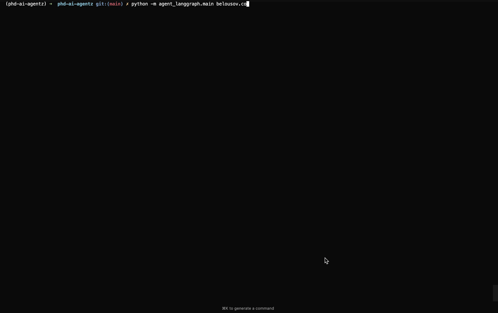

# Сканер безопасности на основе LangGraph

Простой сканер безопасности и сетевой диагностики. Исследует цель используя следующие инструменты:

* ping
* traceroute
* nmap
* nslookup
* Shodan API (нужен ключик)

Вариант достаточно примитивный - все инструменты прибиты гвоздями, хотя модель сама решает какие инструменты когда вызывать.
Для добавления новых инструментов придётся писать код, а это унизительно.

## Запуск:

Из корня репозитория:

```bash
python -m agent_langgraph.main <цель>
```



## Примечания

* Иногда агент решает перезапустить инструмент, если запуск падает с ошибкой/таймаутом. Иногда не решает, инструкций для этого я ему не давал.
